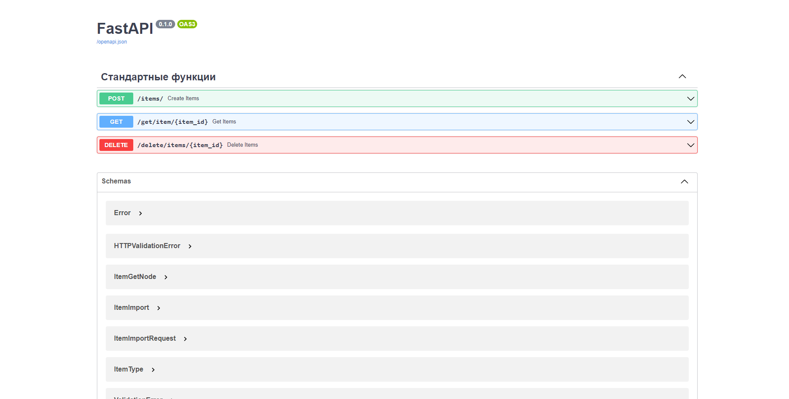

## Бэкенд для веб-сервиса хранения файлов.
Реальзовано: 
-
- Добавление и обновление файлов, папок
- Возвращение элемента по ID
- Удаление элемента по ID
- Папки содержат информацию о размере и свойствах объектов внутри
- Каждый объект содержит информацию о последнем изменении
- При удалении или изменении объекта родительские папки изменяют свой размер
- Контроль правильности свойств добавляемого объекта
- При удалении папки удаляются также все вложенные объекты

## Чтобы запустить в контейнере необходимо слудующее:

## Запускаем Docker Desktop


## Сборка
```
docker-compose build
```

## Запуск
```
docker-compose up -d
```

## Тестирование
Переходим на сайт 
```
http://localhost:8080/docs
```

# FastAPI-CRUD
FastAPI CRUD Example

